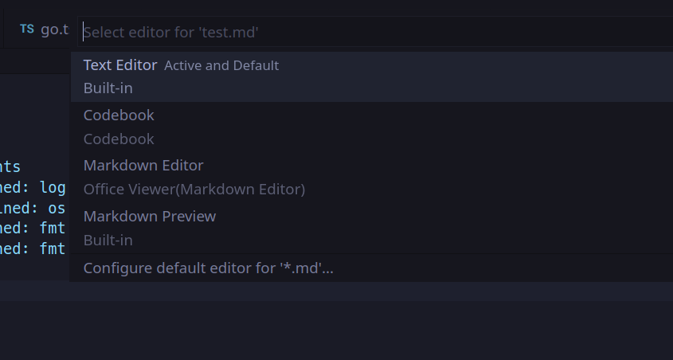

# mdl

Generate AI code blocks into a notebook, and execute them locally through many different languages.

## Quick Start

- Open or create a `.md` document
- Add a cell
- Select a language down the bottom right
- Run the code and save the document
- The output is now saved to standard Markdown
- Upload to Github to see outputs rendered as you would expect

## OpenAI Code Generation

- Set your OpenAI key with the setting `mdl: openai key`
- Default model is gpt-3.5-turbo, change it with `mdl: openai model`
- Select `openai` as your language in the bottom right
- Ask it to show you how to do something in one of the supported lanuages
- Run the code blocks it generates for you

__Important Note__
When you right-click on a file and select `Reopen Editor With...` you can `configure default editor` to be the standard `Text Editor` if you choose, and then only open `mdl` when you need it:


## Description

Straight nodejs stateless implementation for notebooks with no npm dependencies or external binaries, works with compiled languages.

Rather than using complicated kernels, it simply spawns a process that runs your local toolchain for the language you're using and, returning the output and saving it to markdown.

## Keybindings

You can change keybindings in File > Preferences > Keybindings > search for "mdl". Or you can run them via command palette typing in "mdl"

### Search Notes

Set up a folder with `.md` documents in `mdl: base path` and press `alt+f` to open a open search. This allows you to quickly search through your notes and execute code blocks. If you've ever used vimwiki this might bring back memories, but it's not reliant on a specific structure so you can set up your files for whatever static site generator you like.

### Open Generated Code

Press `alt+o` to open up the source code being used to generate outputs, which will allow you to check your code with a language server if it's not supported in the cells yet.

## Language Support

It's very simple to add your own language, look inside [src/languages/rust.ts](https://github.com/jackos/mdl/blob/main/src/languages/python.ts) for an example, then add your language to the switch statement in [`src/kernel.ts`](https://github.com/jackos/mdl/blob/main/src/kernel.ts). Please open a pull request if you add a language.

### OpenAI

Generates code blocks which you can then run

### Mojo

- [x] Import External Code
- [ ] Language Server Support

### Python

- [x] Import External Code
- [x] Language Server Support

### Rust

- [x] Use external code:

```rust
use rand::Rng;
```

- [x] Debug final expression:

```rust
let x = vec![1, 2, 3];
x
```
```output
[1, 2, 3]
```

Or you can pretty debug by putting a `#` on the front:

```rust
let x = vec![1, 2, 3];
#x
```
```output
[
    1,
    2,
    3,
]
```

- [ ] Language Server Support

`Rust-analyzer` does work by hacking with line numbers and ranges on the server end, but it's not reliable enough to release.

### Go

- [x] Import External Code
- [ ] Language Server Support

### Javascript

- [ ] Import External Code
- [x] Language Server Support

### Typescript

- [ ] Import External Code
- [x] Language Server Support

### Shell

- nu
- fish
- bash

## Inspiration

- Jupyter Notebook
- [This comment](https://news.ycombinator.com/item?id=11042400)
- Vimwiki

